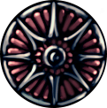

# Hollow Knight Charms 

A simple quick reference for every charm in Hollow Knight

https://justingolden.me/hollowknight

### Using the Website

-   Click on a charm to learn about it

-   View the charm's notch cost, price, location, backstory, effects, and more

-   Hover over the spoiler to reveal how to acquire it

-   Filter by category with the checkboxes at the top of the page. Toggle the "all" checkbox to check or uncheck all categories.

-   More features coming soon!

### Dev

`npx live-server`

### Questions and To-Do

Something wrong? Have an idea? Contact me at [contact@justingolden.me](mailto:contact@justingolden.me) and let me know

Check out the [todo list](https://github.com/justingolden21/hollowknight/blob/master/todo.txt)

### Credits

Website by [Justin Golden](https://justingolden.me)

Using data and images from the [wiki](https://hollowknight.fandom.com/wiki/Category:Charms) and the [official website](https://hollowknight.com)

Made with [jQuery](https://jquery.com/), [Bootstrap](https://getbootstrap.com/), [Popper JS](https://popper.js.org/), and [FontAwesome](https://fontawesome.com/). Images optimized with [ImgBot](https://imgbot.net/) and [Kraken.io](https://kraken.io/web-interface)

### Legal

Hollow Knight is owned by Team Cherry. You can read about the game and find links to purchase it on [their website](https://hollowknight.com/)
